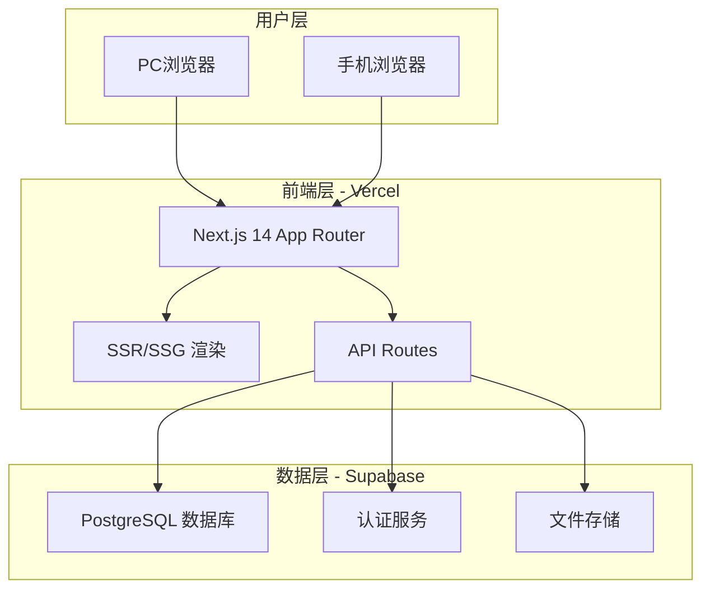
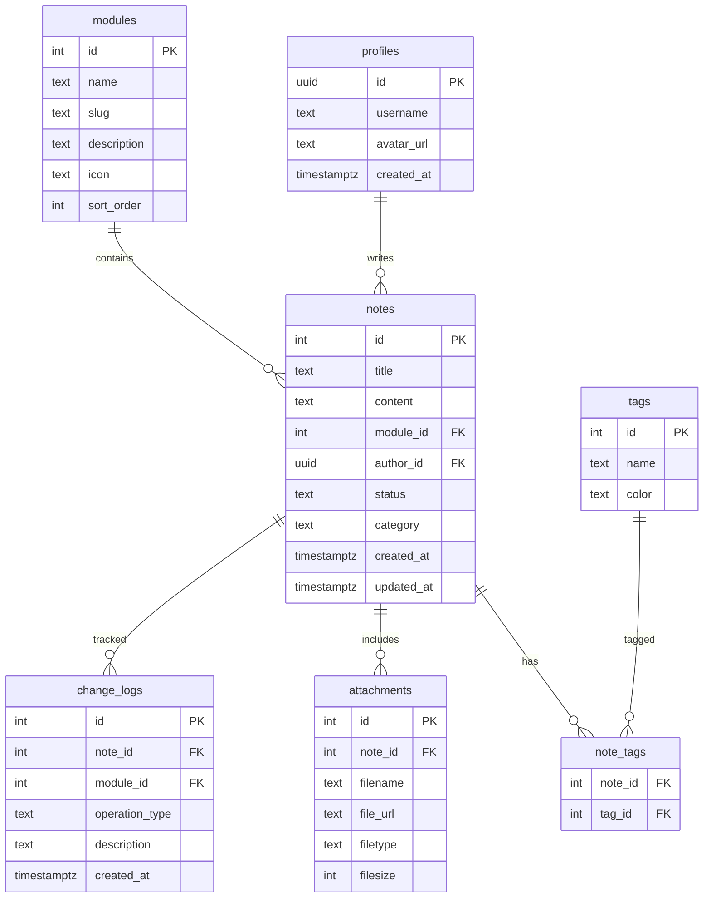
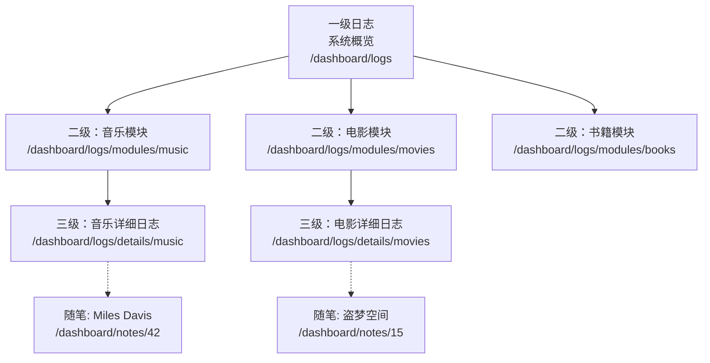

# Serverless Notes 构建计划

## 📋 项目概述

基于 **Next.js 14 + Supabase + Vercel** 的 Serverless 架构个人随笔系统，提供完整的在线后台管理功能。

### 核心目标

- ✅ 完全免费（利用各平台免费额度）
- ✅ 在线编辑（浏览器中直接写作）
- ✅ 跨平台访问（PC + 手机响应式）
- ✅ 云数据库（PostgreSQL 安全存储）
- ✅ 三级日志系统（自动追溯历史）
- ✅ 零运维（云厂商管理基础设施）

### 支持模块

- 🎵 **音乐** - 音乐相关的随笔和评论
- 🎬 **电影** - 电影观后感和影评
- 📚 **书籍** - 读书笔记和书评
- ⚽ **运动** - 运动记录和健身日志
- ✈️ **旅游** - 旅行游记和攻略

---

## 🏗️ 技术架构

### 整体架构



### 技术栈

| 层级 | 技术选型 | 说明 |
|------|---------|------|
| **前端框架** | Next.js 14+ (App Router) | React 全栈框架，支持 SSR/SSG |
| **UI 组件** | Tailwind CSS + Shadcn/ui | 原子化 CSS + 高质量组件 |
| **数据库** | Supabase (PostgreSQL) | 开源 Firebase 替代品 |
| **认证** | Supabase Auth | 内置邮箱/GitHub 登录 |
| **存储** | Supabase Storage | 图片和附件存储 |
| **部署** | Vercel | Next.js 官方部署平台 |
| **编辑器** | Milkdown / ByteMD | Markdown 所见即所得编辑器 |
| **状态管理** | Zustand | 轻量级状态管理 |
| **图标** | Lucide React | 现代化图标库 |

### 费用分析

| 服务 | 免费额度 | 预估用量 | 状态 |
|------|---------|---------|------|
| Vercel | 100GB 带宽/月 | 1-5GB/月 | ✅ 够用 |
| Supabase 数据库 | 500MB | 10-50MB | ✅ 够用 |
| Supabase 存储 | 1GB | 100-500MB | ✅ 够用 |
| Supabase 认证 | 50,000 月活 | 1 人 | ✅ 够用 |
| **总计** | - | - | **0 元/月** |

---

## 🗄️ 数据库设计

### ER 图



### 核心表说明

#### profiles（用户资料表）
- 关联 Supabase Auth 的用户表
- 存储用户名和头像

#### modules（模块表）
- 预置 5 个模块：音乐、电影、书籍、运动、旅游
- 支持自定义图标和排序

#### notes（随笔表）
- 核心内容表
- 支持草稿/发布/归档状态
- 全文搜索索引（tsvector）

#### tags（标签表）
- 支持自定义颜色
- 多对多关联随笔

#### change_logs（修改日志表）
- 通过数据库触发器自动记录
- 支持 CREATE/UPDATE/DELETE/PUBLISH/ARCHIVE 操作

---

## 📂 项目目录结构

```
serverless-notes/
├── src/
│   ├── app/                          # Next.js App Router
│   │   ├── layout.tsx                # 根布局
│   │   ├── page.tsx                  # 首页
│   │   ├── globals.css
│   │   │
│   │   ├── (auth)/                   # 认证页面组
│   │   │   ├── login/page.tsx
│   │   │   └── register/page.tsx
│   │   │
│   │   ├── dashboard/                # 管理后台
│   │   │   ├── layout.tsx            # 后台布局
│   │   │   ├── page.tsx              # 仪表盘
│   │   │   ├── notes/                # 随笔管理
│   │   │   │   ├── page.tsx          # 列表
│   │   │   │   ├── new/page.tsx      # 创建
│   │   │   │   └── [id]/
│   │   │   │       ├── page.tsx      # 查看
│   │   │   │       └── edit/page.tsx # 编辑
│   │   │   ├── modules/[slug]/page.tsx  # 模块详情
│   │   │   ├── tags/page.tsx         # 标签管理
│   │   │   └── logs/                 # 三级日志系统
│   │   │       ├── page.tsx          # 一级：概览
│   │   │       ├── modules/[slug]/page.tsx  # 二级：模块状态
│   │   │       └── details/[slug]/page.tsx  # 三级：详细日志
│   │   │
│   │   └── api/                      # API Routes
│   │       ├── notes/route.ts
│   │       ├── notes/[id]/route.ts
│   │       ├── modules/route.ts
│   │       ├── tags/route.ts
│   │       ├── logs/route.ts
│   │       ├── search/route.ts
│   │       └── upload/route.ts
│   │
│   ├── components/                   # 组件库
│   │   ├── ui/                       # Shadcn/ui 基础组件
│   │   ├── layout/                   # 布局组件
│   │   │   ├── Navbar.tsx
│   │   │   ├── Sidebar.tsx
│   │   │   └── MobileNav.tsx
│   │   ├── notes/                    # 随笔组件
│   │   │   ├── NoteCard.tsx
│   │   │   ├── NoteList.tsx
│   │   │   ├── NoteEditor.tsx
│   │   │   └── NotePreview.tsx
│   │   ├── modules/                  # 模块组件
│   │   │   ├── ModuleCard.tsx
│   │   │   └── ModuleGrid.tsx
│   │   └── logs/                     # 日志组件
│   │       ├── LogTimeline.tsx
│   │       └── LogEntry.tsx
│   │
│   ├── lib/                          # 工具库
│   │   ├── supabase/
│   │   │   ├── client.ts             # 客户端
│   │   │   ├── server.ts             # 服务端
│   │   │   └── middleware.ts         # 认证中间件
│   │   ├── utils.ts
│   │   └── markdown.ts
│   │
│   ├── hooks/                        # 自定义 Hooks
│   │   ├── useNotes.ts
│   │   ├── useModules.ts
│   │   ├── useTags.ts
│   │   └── useAuth.ts
│   │
│   └── types/                        # TypeScript 类型
│       ├── note.ts
│       ├── module.ts
│       ├── tag.ts
│       └── log.ts
│
├── public/                           # 静态资源
├── supabase/                         # Supabase 配置
│   ├── migrations/
│   │   └── 001_initial_schema.sql
│   └── seed.sql
│
├── .env.local.example
├── next.config.js
├── tailwind.config.ts
├── tsconfig.json
└── package.json
```

---

## 🚀 详细实施步骤

### 阶段一：项目初始化（1-2 天）

#### 步骤 1：创建 Next.js 项目

```bash
# 创建项目
npx create-next-app@latest serverless-notes \
  --typescript \
  --tailwind \
  --eslint \
  --app \
  --src-dir

cd serverless-notes

# 初始化 Shadcn/ui
npx shadcn-ui@latest init

# 安装核心依赖
npm install @supabase/supabase-js @supabase/ssr
npm install react-markdown remark-gfm rehype-highlight
npm install lucide-react date-fns zustand
```

**验收标准**：
- ✅ `npm run dev` 可以启动
- ✅ 访问 `http://localhost:3000` 看到默认页面

#### 步骤 2：注册并配置 Supabase

1. 访问 https://supabase.com 注册账号
2. 创建新项目（选择免费计划）
3. 在 SQL Editor 中执行建表脚本（见方案文档）
4. 获取 API 密钥（Settings → API）

创建 `.env.local`：
```env
NEXT_PUBLIC_SUPABASE_URL=https://your-project.supabase.co
NEXT_PUBLIC_SUPABASE_ANON_KEY=your-anon-key
SUPABASE_SERVICE_ROLE_KEY=your-service-role-key
```

**验收标准**：
- ✅ Supabase 项目创建成功
- ✅ 数据表已创建（8 张表）
- ✅ 环境变量配置完成

#### 步骤 3：配置 Supabase 客户端

创建 `src/lib/supabase/client.ts` 和 `src/lib/supabase/server.ts`

**验收标准**：
- ✅ 可以从 Next.js 连接到 Supabase
- ✅ 客户端和服务端都能正常工作

---

### 阶段二：认证与布局（2-3 天）

#### 步骤 4：实现用户认证

**功能清单**：
- [ ] 登录页面（邮箱 + 密码）
- [ ] 注册页面
- [ ] 登出功能
- [ ] 认证中间件（保护后台路由）
- [ ] 用户资料管理

**验收标准**：
- ✅ 可以注册新用户
- ✅ 可以登录和登出
- ✅ 未登录用户无法访问后台

#### 步骤 5：创建应用布局

**功能清单**：
- [ ] 顶部导航栏（Logo、模块导航、用户菜单）
- [ ] 侧边栏（模块列表、快捷操作）
- [ ] 移动端底部导航
- [ ] 响应式布局适配
- [ ] 暗色/亮色主题切换

**验收标准**：
- ✅ 布局在 PC 和手机上都显示正常
- ✅ 主题切换功能正常
- ✅ 导航交互流畅

---

### 阶段三：核心功能开发（5-7 天）

#### 步骤 6：实现随笔管理

**功能清单**：
- [ ] 随笔列表页（分页、排序）
- [ ] 创建随笔页（Markdown 编辑器 + 实时预览）
- [ ] 编辑随笔页
- [ ] 删除随笔（确认对话框）
- [ ] 草稿/发布状态管理
- [ ] 随笔详情页

**技术要点**：
- 使用 Milkdown 或 ByteMD 作为编辑器
- 实时预览功能
- 自动保存草稿

**验收标准**：
- ✅ 完整的随笔 CRUD 功能
- ✅ Markdown 编辑器工作正常
- ✅ 状态切换功能正常

#### 步骤 7：实现模块化管理

**功能清单**：
- [ ] 仪表盘首页（各模块统计卡片）
- [ ] 模块详情页（该模块下的随笔列表）
- [ ] 按模块筛选和浏览
- [ ] 模块图标和颜色配置
- [ ] 模块统计数据

**验收标准**：
- ✅ 五个模块可以独立管理
- ✅ 统计数据准确
- ✅ 筛选功能正常

#### 步骤 8：实现标签和搜索

**功能清单**：
- [ ] 标签管理（创建、编辑、删除、选色）
- [ ] 为随笔添加/移除标签
- [ ] 全文搜索（利用 PostgreSQL tsvector）
- [ ] 按标签、模块、日期筛选
- [ ] 搜索结果高亮

**技术要点**：
- PostgreSQL 全文搜索
- 搜索结果排序和高亮

**验收标准**：
- ✅ 标签系统完整
- ✅ 搜索功能准确快速
- ✅ 筛选功能正常

#### 步骤 9：实现三级日志系统

**功能清单**：
- [ ] **一级日志**：系统概览仪表盘
  - 总随笔数、各模块统计
  - 最近更新时间线
  - 链接到各模块状态页
- [ ] **二级日志**：模块状态页
  - 模块功能描述
  - 该模块的随笔统计
  - 链接到详细日志
- [ ] **三级日志**：详细修改记录
  - 按日期分组的修改日志
  - 操作类型、描述、关联文件链接
  - 支持导出为 Markdown

**技术要点**：
- 数据库触发器自动记录
- 日志分级展示
- 时间线组件

**验收标准**：
- ✅ 三级日志页面完整
- ✅ 自动记录所有操作
- ✅ 日志导航流畅

---

### 阶段四：附件和高级功能（2-3 天）

#### 步骤 10：实现附件管理

**功能清单**：
- [ ] 图片上传到 Supabase Storage
- [ ] 在 Markdown 中插入图片
- [ ] 文件预览和删除
- [ ] 图片压缩（客户端）
- [ ] 拖拽上传

**验收标准**：
- ✅ 可以上传和管理图片附件
- ✅ 图片在 Markdown 中正常显示
- ✅ 文件管理功能完整

#### 步骤 11：实现日志导出

**功能清单**：
- [ ] 导出为 Markdown 文件
- [ ] 保持与静态方案兼容的格式
- [ ] 包含完整的超链接
- [ ] 可以保存到本地

**导出格式示例**：
```markdown
# 2024年3月 音乐模块修改日志

## 2024-03-24

### 新增
- 创建随笔: Miles Davis 的 Kind of Blue
  - 链接: /dashboard/notes/42
  - 模块: 音乐
  - 标签: 爵士乐, Miles Davis
```

**验收标准**：
- ✅ 导出的日志文件格式正确
- ✅ 超链接有效
- ✅ 与静态方案兼容

---

### 阶段五：部署和优化（1-2 天）

#### 步骤 12：部署到 Vercel

**部署方式一：CLI**
```bash
npm i -g vercel
vercel login
vercel
```

**部署方式二：网站**
1. 访问 https://vercel.com
2. 导入 GitHub 仓库
3. 配置环境变量
4. 点击部署

**环境变量配置**：
- `NEXT_PUBLIC_SUPABASE_URL`
- `NEXT_PUBLIC_SUPABASE_ANON_KEY`
- `SUPABASE_SERVICE_ROLE_KEY`

**验收标准**：
- ✅ 网站可以通过 `https://your-project.vercel.app` 访问
- ✅ 所有功能正常工作
- ✅ 环境变量配置正确

#### 步骤 13：性能优化

**优化清单**：
- [ ] 图片懒加载
- [ ] 组件代码分割
- [ ] API 缓存策略
- [ ] SEO 优化（meta 标签、OG 图片）
- [ ] 压缩和优化资源

**验收标准**：
- ✅ Lighthouse 评分 > 90
- ✅ 首屏加载时间 < 2s
- ✅ SEO 友好

#### 步骤 14：测试和文档

**测试清单**：
- [ ] 核心功能手动测试
- [ ] 移动端适配测试
- [ ] 跨浏览器测试
- [ ] 性能测试

**文档清单**：
- [ ] 编写 README.md
- [ ] 编写使用文档
- [ ] 编写日志维护规范
- [ ] 编写部署文档

**验收标准**：
- ✅ 所有功能测试通过
- ✅ 文档完善

---

## 🔌 API 设计

### 随笔 API
```
GET    /api/notes              # 获取随笔列表（支持分页、筛选）
POST   /api/notes              # 创建随笔
GET    /api/notes/[id]         # 获取单个随笔
PUT    /api/notes/[id]         # 更新随笔
DELETE /api/notes/[id]         # 删除随笔
```

### 模块 API
```
GET    /api/modules            # 获取所有模块
GET    /api/modules/[slug]     # 获取模块详情和统计
```

### 标签 API
```
GET    /api/tags               # 获取所有标签
POST   /api/tags               # 创建标签
PUT    /api/tags/[id]          # 更新标签
DELETE /api/tags/[id]          # 删除标签
```

### 搜索 API
```
GET    /api/search?q=keyword   # 全文搜索
```

### 日志 API
```
GET    /api/logs               # 获取日志列表
GET    /api/logs/export        # 导出日志为 Markdown
GET    /api/logs/stats         # 获取统计数据
```

### 文件上传 API
```
POST   /api/upload             # 上传文件到 Supabase Storage
DELETE /api/upload/[id]        # 删除文件
```

---

## 📊 日志系统设计

### 三级日志结构



### 自动记录机制

通过数据库触发器自动记录：
- **INSERT**：创建新随笔时
- **UPDATE**：更新随笔内容时
- **DELETE**：删除随笔时

---

## ⏱️ 时间估算

| 阶段 | 任务 | 预计时间 |
|------|------|---------|
| **阶段一** | 项目初始化 | 1-2 天 |
| **阶段二** | 认证与布局 | 2-3 天 |
| **阶段三** | 核心功能开发 | 5-7 天 |
| **阶段四** | 附件和高级功能 | 2-3 天 |
| **阶段五** | 部署和优化 | 1-2 天 |
| **总计** | - | **2-3 周** |

---

## ✅ 预期成果

完成本构建计划后，您将拥有：

1. ✅ 功能完整的在线随笔管理系统
2. ✅ 任何设备的浏览器均可访问和编辑
3. ✅ 完全免费（Vercel + Supabase 免费额度）
4. ✅ PostgreSQL 云数据库，数据安全
5. ✅ 完整的三级日志追溯系统（自动记录）
6. ✅ 全文搜索和标签筛选
7. ✅ Markdown 编辑器 + 实时预览
8. ✅ 暗色/亮色主题
9. ✅ 响应式设计，适配 PC 和手机

---

## 📝 下一步行动

请确认本构建计划是否符合您的需求。如果满意，我们可以：

1. **切换到 Code 模式**，开始实际搭建系统
2. 或者您可以提出修改建议，我将调整计划

---

**文档版本**：v1.0  
**创建日期**：2026-03-24  
**最后更新**：2026-03-24